### I'm Tanner. I'm building [Ix](https://ix-infra.com).

I work on persistent memory, world models, and AI teammates that turn context into action.

- **[Kartr](https://ix-infra.com)**: AI teammates that handle the busywork.
- **[Ix](https://ix-infra.com/ix)**: persistent memory and codebase context for coding agents.

Interested in agents that remember what happened and know what to do next? [Let's talk.](https://ix-infra.com/contact)

  <a href="https://ix-infra.com">Website ↗</a> &nbsp;·&nbsp;
  <a href="https://ix-infra.com/team">The team ↗</a>
  <iframe src="https://github.com/sponsors/ix-infrastructure/button" title="Sponsor ix-infrastructure" height="32" width="114" style="border: 0; border-radius: 6px;"></iframe>

